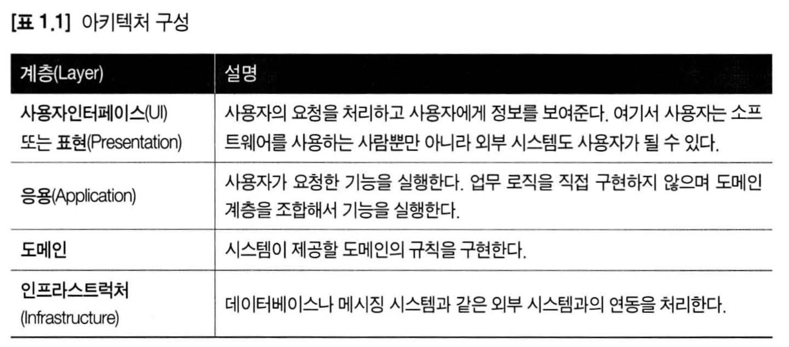
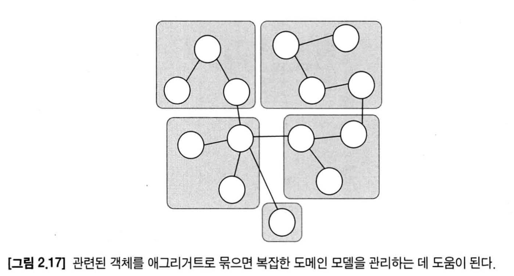
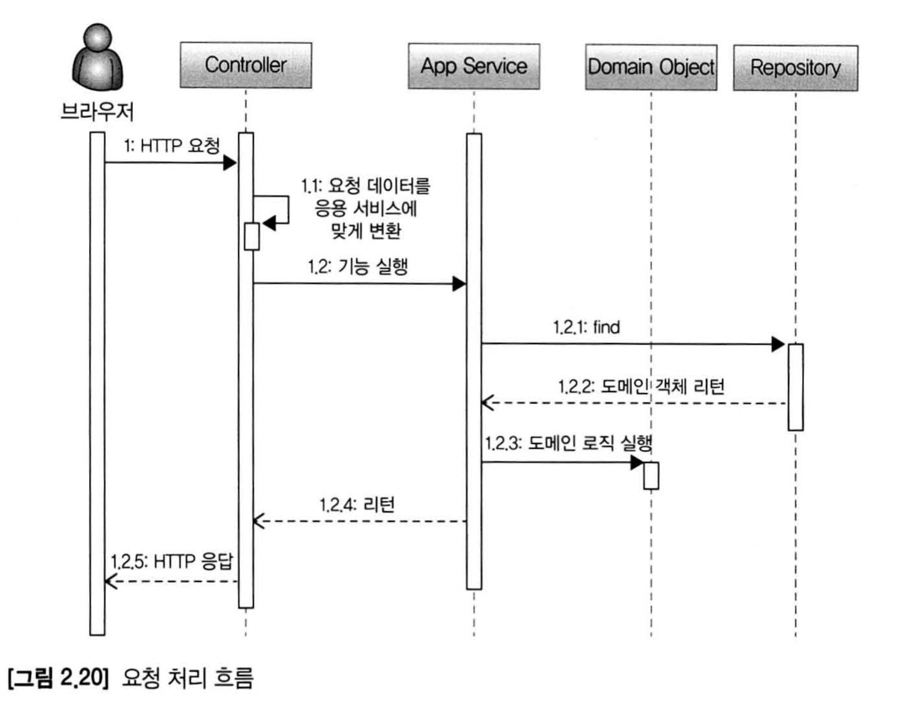
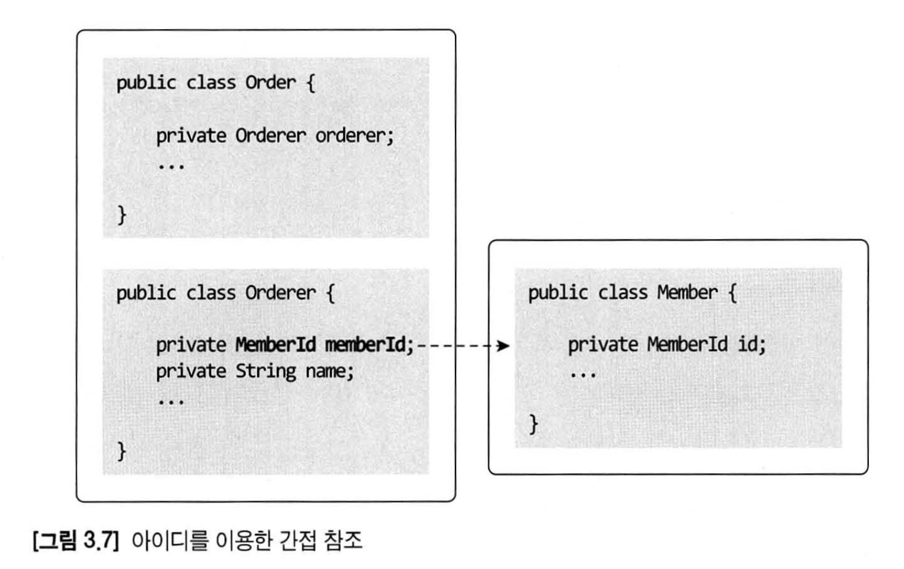

# DDD Start

# Chapter 1 도메인 모델의 시작
## 도메인 모델
- 도메인 자체를 표현하는 개념적인 모델을 의미하지만, 도메인 계층을 구현할 때 사용하는 객체 모델을 언급할 때에도 '도메인 모델'  이란 용어를 사용한다.  
도메인 계층의 객체 모델을 표현할 때 도메인 모델이라고 표현하고 있다.

### 개념 모델과 구현모델
- 처음부터 완벽한 개념 모델을 만들기보다는 전반적인 개요를 알 수 있는 수준으로 개념 모델을 작성해야한다.
- 프로젝트 초기에는 개요 수준의 개념모델로 도메인에 대한 전체 윤곽을 이해하는데 집중하고, 구현하는 과정에서 개념 모델을 구현모델로 점진적으로 발전시켜 나가야 한다.

## 도메인 모델 패턴
사용자인터페이스(UI) : 사용자의 요청을 처리하고 사용자에게 정보를 보여준다.  
응용 (Application) : 사용자가 요청한 기능을 실행한다.  
도메인 : 시스템이 제공할 도메인의 규칙을 구현한다.  
인프라스트럭처(Infrastructure) : 데이터베이스나 메시징 시스템과 같은 외부 시스팀과의 연동을 처리한다.  

## 도메인 모델 도출
- 구현을 시작하려면 도메인에 대한 초기 모델이 필요하다.
- 도메인을 모델링할 때 기본이 되는 작업은 모델을 구성하는 **핵심 구성요소**, **규칙**, **기능**을 찾는것이다.
- 이 과정은 요구사항에서 출발한다.

### 문서화
- 문서화를 하는 주된 이유는 지식을 공유하기 위함이다.
- 전반적인 기능 목록이나 모듈 구조, 빌드 과정은 코드를 보고 직접 이해하는 것보다 상위 수준에서 정리한 문서를 참조하는 것이 소프트웨어  
전반을 빠르게 이해하는데 도움이 된다.

## 엔티티와 밸류
- 도출한 모델은 크게 엔티티(Entity)와 밸류(Value)로 구분할 수 있다. 

### 엔티티
- 가장 큰 특징은 식별자를 갖는다
- 각 엔티티는 서로 다른 식별자를 갖는다.

### 밸류 타입 
- 개념적으로 완전한 하나를 표현할 때 사용한다.
- 코드의 의미를 더 잘 이해할 수 있도록 한다.
- 밸류 객체의 데이터를 변경할 때는 기존 데이터를 변경하기 보다는 변경한 데이터를 갖는 새로운 밸류 객체를 생성하는 방식을 선호한다.
- 밸류 타입을 **불변**으로 구현하는 가장 중요한 이유는 안전한 코드를 작성할 수 있다는 것이다.
- 밸류 타입이 같은지를 비교할때는 모든 속성이 같은지 비교해야 한다.

### 엔티티 식별자와 밸류타입
- Money가 단순 숫자가 아닌 도메인의 '돈'을 의미하는 것처럼 이런 식별자는 단순한  
문자열이 아니라 도메인엣 ㅓ특별한 의미를 지니는 경우가 많기 떄문에 식별자를 위한 밸류타입을 사용해서 의미가 잘 드러나도록 할 수 있다.

### 도메인 모델에 set 메서드 넣지 않기
- 도메인 모델에 get/set 메서드를 무조건 추가하는 것은 좋지 않은 버릇이다.
- set 메서드는 도메인의 핵심 개념이나 의도를 코드에서 사라지게 한다.
- 도메인 객체가 불완전한 상태로 사용되는 것을 막으려면 생성시점에 필요한 것을 전달해 주어야한다.
- 즉, 생성자를 통해 필요한 데이터를 모두 받아야한다.

## 도메인 용어
- 도메인 용어는 좋은 코드를 만드는 데 매우 증요한 요소다
- 알맞은 영어 단어를 찾는 것은 쉽지 않은 일이지만 시간을 들여 찾는 노력을 해야한다.

# Chapter 2 아키텍처 개요
## 네 개의 영역

## 계층 구조 아키텍처
- 계층 구조에 따르면 표현, 응용, 도메인 계층이 상세한 구현 기술을 다루는 인프라스터럭처 계층에 종속된다
- 인프라스트럭처에 의존하면 '테스트 어려움'과 '기능 확장의 어려움'이라는 두가지 문제가 발생한다
- 이 두묹제를 해결하려면 DIP를 적용해야한다

## DIP (Dependency Injection Principle)
- 고수준 모듈이 제대로 동작하려면 저수준 모듈을 사용해야한다.  
그런데, 고수준 모듈이 저수준 모듈을 사용하면 앞서 계층 구조 아키텍처에서 언급했던 두가지('테스트 어려움'과 '기능 확장의 어려움')
문제가 발생한다
- DIP는 저수준 모듈이 고수준 모듈에 의존하도록 바꾼다. -> **비밀은 추상화한 인터페이스에 있다.**

### DIP 주의사항
- DIP의 핵심은 고수준 모듈이 저수준 모듈에 의존하지 않도록 하기 위함이다.
- DIP를 적용할 떄 하위 기능을 추상화한 인터페이스는 고수준 모듈 관점에서 도출한다.

### DIP와 아키텍처

## 도메인 영역의 주요 구성요소
1. 엔티티
2. 밸류
3. 애그리거트
4. 리포지터리
5. 도메인 서비스 : 특정 엔티티에 속하지 않는 도메인 로직을 제공한다. 도메인 로직이 여러 엔티티와 밸류를 필요로 할 경우 도메인 서비스에서 로직을 구현한다.

### 애그리거트
- 도메인 모델도 개별 객체뿐만 아니라 상위 수준에서 모델을 볼 수 있어야 전체 모델의 관계와 개별 모델을 이해하는데 도움이 된다.
- 도메인 모델에서 전체 구조를 이해하는데 도움이 되는것이 에그리거트이다.
- 애그리거트는 관련 객체를 하나로 묶은 군집이다.


### 리포지터리
- 도메인 객체를 지속적으로 사용하려면 RDBMS, NoSQL, 로컬 파일과 같은 물리적인 저장소에 도메인 객체를 보관해야한다.
- 이를 위한 도메인 모델이 리포지터리이다.
- 리포지터리의 사용 주체가 응용 서비스이기 떄문에 리포지터리는 응용서비스가 필요로하는 메서드를 제공한다.

## 요청 처리 흐름


## 인프라스터럭처 개요
- 표현 영역, 응용 영역, 도메인 영역을 지원한다.
- 무조건 인프라스트럭처에 대한 의존을 없애는 것이 좋은 것은 아니다.
- 예로 @Transaction 애노테이션이있다 (자세한 이유는 P67)

## 모듈 구성
- 각 애그리거트와 모델과 리포지터리는 같은 패키지에 위치시킨다.
- 예를 들어, 주문과 관련된 Order, OrderLine, Orderer, OrderRepository 등은 com.myshop.order.domain 패키지에 위치시킨다.
- 한 패키지에 너무 많은 타입이 몰려서 코드를 찾을 때 불편한 정도만 아니면 된다.
- 저자는 한패키지에 가능하면 10개 미만으로 타입 개수를 유지하려고 노력한다고한다
- 이 개수가 넘어가면 모듈을 분리하는 시도를 해본다.

# Chapter 3 애그리거트

## 애그리거트 
- 애그리거트는 모델을 이해하는데 도움을 줄 뿐만 아니라 일관성을 관리하는 기준이 된다.
- 한 애그리거트에 속한 객체는 다른 애그리거트에 속하지 않는다.

## 애그리거트 루트
- 애그리거트에 속한 모둔 객체가 일관된 상태를 유지하려면 애그리거트 전체를 관리할 주체가 필요한데 이 책임을지는것이 바로
애그리거트의 루트 앤티티이다.

### 도메인 규칙과 일관성
- 불필요한 중복을 피하고 애그리거트 루트를 통해서만 도메인 로직을 구현하게 만들려면 아래의 두가지를 적용해야한다
  - 단순히 필드를 변경하는 set 메서드르 공개(public) 범위로 만들지 않는다.
  - 밸류 타입은 불변으로 구현한다.
- 공개 set 메서드를 만들지 않는것의 연장으로 밸류는 불변타입으로 구혀한다.
```java
ShippoingInfo si = order.getShippingInfo();
si.setAddress(newAddress); //ShippingInfo 밸류 객체가 불변이면, 이 코드는 컴파일 에러!
```

### 애그리거트 루트의 기능 구현
- 애그리거트 루트는 애그리거트 내부의 다른 객체를 조합해서 기능을 완성한다.
- 애그리거트 루트가 구성요소의 상태만 참조하는 것은 아니다. 기능 실행을 위임하기도 한다.(예제코드 P81)
- 팀 표준이나 구현 기술의 제약으로 OrderLines(밸류 타입)를 불변으로 구현할 수 없다면 OrderLines의 변경 기능을 패키지나
protected 범위로 한정해서 외부에서 실행할 수 없도록 제한하는 방법이 있다.

### 트랜잭션 범위
- 트랜잭션 범위는 작을 수록 좋다.
  - 잠금 대상이 많아진다는 것은 그만큼 동시에 처리할 수 있는 트랜잭션 개수가 줄어든다는 것을 뜻하고 이는 전체적인 성능(처리량)을
  떨어 뜨린다.
- **한 트랜잭션에서는 한 개의 애그리거트만 수정해야한다.**
- 한 애그리거트에서 다른 애그리거트를 수정하면 결과적으로 두개의 애그리거트를 한 트랜잭션에서 수정하게 되므로 한 애그리거트 내부에서  
다른 애그리거트의 상태를 변경하는 기능을 실행하면 안 된다.
- (에제 코드 83)
- 해결방법 두가지
  - 응용서비스에서 두 애그리거트를 수정하도록 구현한다.
  - 도메인 이벤트를 사용한다.
- 한 트랜잭션에서 한개의 애그리거트를 변경하는 것을 권장하지만 다음의 경우에는 한개의 트랜잭션에서
두개 이상의 애그리거트를 변경하는 것을 고려할 수 있다.
  - 팀표준
  - 기술 제약
  - UI 구현의 편리

## 리포지터리와 애그리거트
- 애그리거트는 개념상 완전한 한 개의 도메인 모델을 표한하므로 객체의 영속성을 처리하는 **리포지터리는 애그리거트 단위로 존재**한다.
- 애그리거트는 개념적을 하나이므로 리포지터리는 애그리거트 전체를 저장소에 영속해야한다.
- 애그리거트를 영속화할 저장소로 무엇을 사용하든지 간에 **애드리거트의 상태가 변경되면 모든 변경을 원자적을 저장소에 반영**해야한다.
  - 애그리거트에서 두 개의 객체를 변경했는데 저장소에는 한 객체에 대한 변경만 반영되면 데이터 **일관성**이 깨지므로 문제가 된다.

## ID를 이용한 애그리거트 참조
- 필드를 이용한 애그리거트 참조는 다음의 문제를 야기한다
  - 편한 탐색 오용 (셋중 가장 큰 문제)
  - 성능에 대한 고민
  - 확장 어려움

- 위 세가지 문제를 완화할 때 사용할 수 있는것이 ID를 이용해서 다른 애그리거트를 참조하는 것이다.



### ID를 이용한 참조와 조회 성능
- 다른 애그리거트를 ID로 참조하면 참조하는 여러 애그리거트를 읽어야 할 때 조회 속도가 문제될 수 있다.
- ID 참조 방식을 사용하면서 N + 1 조회와 같은 문제가 발생하지 않도록 하려면 전용 조회 쿼리르 사용하면 된다.
- 쿼리가 복잡하거나 SQL에 특화된 기능을 사용해야 한다면 조회를 위한 부분만 MyBatis와 같은 기술을 이용해서 실행할 수 있다.
- 애그리거트마다 서로 다른 저장소를 사용하는 경우에는 한 번의 쿼리로 관련 애그리거트를 조회할 수 없다.
  - 이런 경우 조회 성능을 높이기 위해 캐시를 적용하거나 조회 전용 저장소를 따로 구성한다.
  
## 애그리거트 간 집합 연관

## 애그리거트를 팩토리로 사용하기
- 애그리거트가 갖고 있는 데이터를 이용해서 다른 애그리거트를 생성해야 한다면 애그리거트에 팩토리 메서드를 구현하는 것을  
고려해보자.

# chapter 4 리포지터리와 모델구현

## JPA를 이용한 리포지터리 구현
### 모듈 위치
### 리포지터리 기본 기능구현
- 두가지 기본기능
  - 아이디로 애그리거트 조회하기
  - 애그리거트 저장하기

## 매핑 구현
### 엔티티와 밸류 기본 매핑 구현
- JPA 매핑 기본 규칙
  - 애그리거트 루트는 엔티티 이므로 @Entity로 매핑한다
  - 한 테이블에 엔티티와 밸류데이터가 같이 있다면,
    - 밸류는 @Embeddable로 매핑설정한다.
    - 밸류 타입 프로퍼티는 @Embedded로 매핑 설정한다.

### 기본 생성자
- JPA의 @Entity와 @Embedable로 클래스를 매핑하려면 기본생성자를 제공해야한다.
- 이런 기술적인 제약으로 불변 타입은 기본생성자가 필요없음에도 불구하고 기본 생성자를 추가해야한다.
- 기본 생성자를 다른 코드에서 사용하면 값이 없는 온전하지 못한 객체를 만들게 된다. 이런 이유로 **다른 코드에서 기본생성자를
사용하지 못하도록 protected로 선언한다.**

### 필드 접근 방식 사용
- 엔티티가 객체로서 제 역할을 하려면 외부에 set 메서드 대신 의도가 잘 드러나는 기능을 제공해야한다.
- JPA매핑 처리를 프로퍼티 방식이 아닌 필드 방식으로 선택해서 불필요한 get/set 메서드를 구현하지 말아야한다.


### AttributeConverter를 이용한 밸류 매핑 처리
### 밸류 컬렉션 : 별도 테이블 매핑
- @ElementCollection
- @CollectionTable

### 밸류 컬렉션 : 한 개 칼럼 매핑
- AttributeConverter
- 읽기전용으로 Set을 생성한다. -> Collections.unmodifiableSet(emails)

### 밸류를 이용한 아이디 매핑
- 밸류 타입으로 식별자를 구현할 때 얻을 수 있는 장점
  - 식별자에 기능을 추가할 수 있다는 점이다.
   
### 별도 테이블에 저장하는 밸류 매핑
- 단지 별도 테이블에 데이터를 저장한다고 해서 엔티티인 것은 아니다
- 밸류가 아니라 엔티티가 확실하다면 다른 애그리거트는 아닌지 확인해야한다.
- 식별하는 방법은 고유 식별자를 갖고 있는지 여부를 확인하는 것이다.
  - 별도 테이블로 저장되고 테이블에 PR가 있다고 해서 테이블과 매핑되는 애그리거트 구성요소가 고유 식별자를 갖는 것은 아니다.

### 밸류 컬렉션을 @Entity로 매핑하기
- JPA는 @Embeddable(밸류 타입) 타입의 클래스 상속 매핑을 지원하지 않는다.
- 상속 구조를 갖는 밸류 타입을 사용하려면 @Embedable대신 @Entity를 이용한 상속 매핑으로 처리해야한다.
- 밸류 타입을 @Entity로 매핑하므로 식별자 매핑을 위한 필드도 추가해야한다.(P130)
- @Embeddable타입에 대한 컬렉션의 clear() 메서드를 호출하면 컬렉션에 속한 객체를 로딩하지 않고  
한번의 delete쿼리로 삭제 처리를 수행한다
- 코드 유지보수와 성능의 두 가지 측면을 고려해서 구현 방식을 선택해야한다.

### ID참조와 조인 테이블을 이용한 단방향 M:N 매핑
- 애그리거트 간 집합 연관은 성능상의 이유로 피해야 한다
- 그럼에도 불구하고 요구사항을 구현하는 데 집합 연관을 사용하는 것이 유리하다면 ID 참조를 이용한 단방향 집합 연관을 적용해 볼 수 있다.

## 애그리거트 로딩 전략
- 애그리거트 루트를 로딩하면 루트에 속한 모든 객체가 완전한 상태여야 함을 의미한다.
- 애그리거트는 **개념적으로 하나여야 하나** 루트 엔티티를 로딩하는 시점에 애그리거트에 속한 객체를 모두 로딩해야 하는것은 아니다.
1. 상태를 변경하는 기능을 실행할 때 애그리거트 상태가 완전해야하고
2. 표현 영역에서 애그리거트의 상태 정보를 보여줄 떄 필요하기 때문이다.
- 무조건 즉시 로딩이나 지연로딩으로만 설정하기 보다는 애그리거트에 맞게 즉시 로딩과 지연로딩을 선택해야한다.

## 애그리거트 영속성 전파
- 저장 메서드는 애그리거트 루트만 저장하면 안 되고 애그리거트에 속한 모든 객체를 저장해야한다.
- 삭제 메서드는 애그리거트 루트뿐만 아니라 애그리거트에 속한 모든 객 체를 삭제 해야한다.

## 식별자 생성 기능
- 사용자가 직접 생성
- 도메인 로직으로 생성
- DB를 이용한 일련번호 생성


