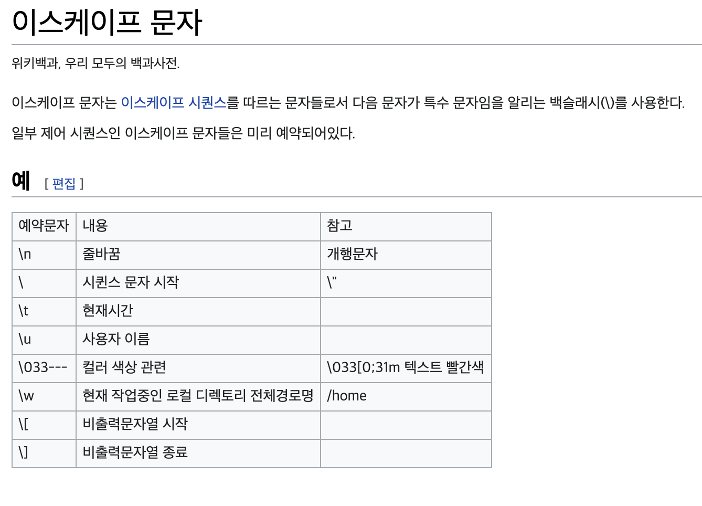

## 변수란?
- 하나의 값을 저장할 수 있는 **메모리 공간**이다
- **변수는 선언된 블록 내에서만 사용이 가능하다.**

### 변수이름 명명 규칙
1. 첫번째 글자는 문자이거나 '$', '_' 여야 하고 숫자로 시작할 수 없다
2. 영어 대소문자가 구분된다(필수) -> firstname 과 firstName은 다른 변수다
3. 첫문자는 영어 소문자로 시작하되, 다른 단어가 붙을 경우 첫자를 대문자로 한다 -> maxSpeed, firstName
4. 문자 수(길이)의 제한은 없다.
5. 자바 예약어는 사용할 수 없다.

## 변수 값 읽기
- 변수는 초기화 되어야 읽을 수 있고, 초기화되지 않는 변수는 읽을 수가 없다.

## 리터럴(literal)
- 소스 코드 내에서 직접 입력된 값
- 종류 : 정수 리커럴, 실수 리터럴, 문자 리터럴, 문자열 리터럴, 논리 리터럴
- 정수 리터럴을 저장할 수 있는 타입은 byte, char, short, int, long 과 같이 5개가 있다.

### 실수 리터럴
- 소수점이 있는 리터럴은 10 진수 실수로 간주 한다
- 대문자 E또는 소문자 e가 있는 리터럴은 10진수 지수와 가수 간주 한다
  - 5E7 // 5*10 의 7승
  - 0.12E-5 // 0.12 * 10의 -5승
- 실수 리터럴을 저장할 수 있는 타입은 float, double 이 있다.

### 문자 리터럴
- 작은 따옴표 (') 로 묶은 텍스트는 하나의 문자 리터럴로 간주한다.
- '\t'(수평 탭), '\n'(줄 바꿈), '\r'(리턴) .. 이스케이프 문자들도 유니코드를 갖고있기에 하나의 문자로 취급을 받는다.
- 
- '\u16진수' 16진수에 해당하는 유니코드
- 문자 리터럴을 저장할 수 있는 타입은 char 하나 뿐이다.

### 문자열 리터럴
- 큰따옴표 ("") 로 묶은 텍스트는 문자열 리터럴로 간주한다
- 큰따옴표 안에는 텍스트가 없어도 문자열 리터럴로 간주 된다.
- 리터럴 내부에서 이스케이프 문자를 사용할 수 있다.
- 문자열 리터럴을 저장할 수 있는 타입은 String 하나 뿐이다.

### 논리 리터럴
- true와 false는 논리 리터럴로 간주한다.
- true, false
- 논리 리터럴을 저장할 수 있는 타입은 boolean 하나뿐이다.

  
  
 